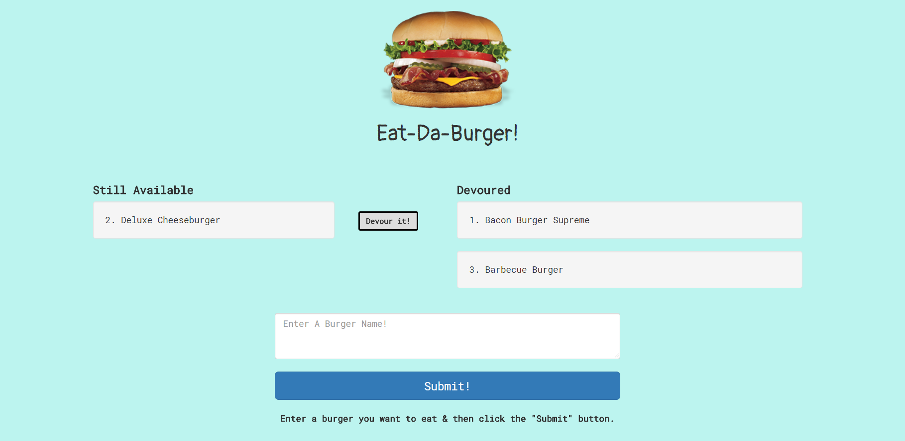

# Express/MySQL/Handlebars "Eat-Da-Burger" App

[View Live!](https://ancient-coast-35348.herokuapp.com/)

## Brief Description

The **Express/MySQL/Handlebars "Eat-Da-Burger" App** uses the **MVC** design pattern & a homemade **ORM** to store various types of burgers inside a database. These burgers are either uneaten, or have already been devoured. The ones that are uneaten appear on the left side of the screen when the app is loaded, with a button next to each that says "Devour It!", and the already-devoured ones appear on the right side. When a user clicks a "Devour It!" button, the "devoured" property of that burger's record in the database is changed to "true", which is what causes it to move to the "devoured" section. Users can submit the name of a new burger and it will appear on the left side, which is labeled "Still Available".

## How This Was Achieved   

Two initial files needed to be set up before working on the rest of the app. The first file is the *"connection.js"* file, which creates the **MySQL** connection to the burgers database & exports it for use by other files. The second file is the *"server.js"* file, which sets up all the **NPM Package** dependencies, activates the **ExpressJS** server, & requires the *"burger_controller.js"* in order to use its **API** routes. 

The Connection file is exported directly to the *"ORM.js"* file. The **ORM** creates an object which stores within it several different MySQL functions that will be utilized by the app to access the database. These functions basically serve as a template for future queries that will plug specific values into said functions. The first function allows all records from the database to be selected. The second function allows a new record to be inserted into the database. The third function allows an existing record to be updated. These functions are then exported as part of the ORM object on the page.

This object gets passed on to the *"burger.js"* file in the **Models** folder. The burger.js file uses these functions and sets up them up to be used specifically to access the burgers table. This file is also essentially an ORM, but it serves as an ORM for the burgers table only. If we had other tables in the database, we would be using other Models files to represent each of those tables. The functions from the burger.js file are then exported as part of the "burger" object on the page. 

Now it comes time for these MySQL query templates, essentially, to actually be used in practice. This is where the "burgers_controller.js" file comes into play. This file sets up all of the routes that handle the **AJAX requests** that the app will be sending. A GET request is set up to make sure that when the app's homepage URL is typed in, the app's homepage is displayed and shows all the burgers in the database. A POST request is set up to make sure that when new data is submitted to the server, it gets added to the database. Finally, a PUT request is set up to allow the user to change the "devoured" state of a burger within the database. 

All of the above describes what happens on the Back-End of the app. Now it's time to discuss the Front-End. On the Front-End, we use the **Handlebars** templating engine to display the HTML for our app & to take in data that is sent to it by the **Controller** file. The data that it gets sent is an object containing an array of all the records within the database. Special Handlebars syntax is used to display each item within the array and to separate the items with the devoured property set to true & those with the devoured property set to false into 2 separate columns. A submit form is also created at the bottom of the page to allow users to add new burgers to the database, which will then pop up on the page. 

A Front-End javascript file is then used to handle what happens when various buttons on the page are clicked. When the "submit" button is clicked, a POST request is sent to the **Controller** file which then adds a new item to the database. When a "Devour It!" button is clicked, a PUT request is sent to the Controller, which then makes sure the database sees the corresponding burger as "devoured", and the page is reloaded to make the info for that burger appear on the "Devoured" side of the page. 